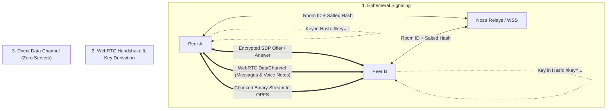

# PeerBox


**Serverless, zero-login peer-to-peer workspace for real-time room communication and chunked multi-peer file streaming via WebRTC & Nostr.**

[](https://peer-box.ii2d.com)
[](https://github.com/ii2d/peer-box/actions/workflows/deploy.yml)
[](https://github.com/ii2d/peer-box/actions/workflows/codeql.yml)


---

## Overview

**PeerBox** is an open-source, serverless web application designed for private, browser-to-browser collaboration. There are no user accounts, no central application servers, no databases, and no intermediaries inspecting or storing your content.

Peers discover each other in a virtual **Room** using ephemeral **Nostr** signaling (with BitTorrent tracker fallback via [Trystero](https://github.com/oxilor/trystero)) and establish direct **WebRTC DataChannels** for end-to-end encrypted messaging, voice memos, screen captures, and high-performance file transfers.

---

## Core Trust Guarantees

PeerBox is built on four verifiable architectural assurances:

1. **Zero Servers & Intermediaries**: All communication and file transmission occurs directly between peer browsers via WebRTC. No central server relays, buffers, or stores your messages or files.
2. **Room Key Encryption**: Discovery and room traffic are secured using keys derived from a shared secret **Room Key**. The Room Key resides strictly in the URL hash fragment (`#key=...`), which web browsers never transmit to hosting servers.
3. **Ephemeral In-Memory State**: No central database or cloud storage. Chat history, active peer presence, and transfers exist purely in volatile browser memory and are discarded immediately upon closing or refreshing the tab.
4. **Direct P2P & Transparent IP Disclosure**: PeerBox operates exclusively peer-to-peer without central TURN relays ([ADR-0001](docs/adr/0001-zero-turn-relay-architecture.md)). Direct WebRTC connections inherently exchange IP addresses between connected peers, ensuring no third party can intercept or decrypt your data ([ADR-0004](docs/adr/0004-transparent-webrtc-ip-disclosure.md)).

---

## Features

- **⚡ Direct P2P Messaging**: Low-latency text messaging with optional 1-to-1 **Recipient Targeting** or broadcast to the entire room.
- **📦 Chunked OPFS File Transfers**: Direct browser-to-browser streaming for files of any size (including large files ≥ 25MB) written directly to disk via the **Origin Private File System (OPFS)** without memory exhaustion.
- **🎙️ Ephemeral Voice Notes**: Record and preview audio memos directly in-browser using Opus encoding with interactive waveform playback.
- **📸 Instant Screen Grabs**: Capture and send a single display or window frame without heavy ongoing video call overhead.
- **📊 Real-Time WebRTC Telemetry**: Live measurement of peer connection type (`⚡ Direct LAN` vs `🌐 Direct P2P`), round-trip latency (ping), transfer throughput, and transfer ETA.
- **📱 Responsive Workspace Layout**: Edge-to-edge desktop experience with a 2-column **Roster** and **Timeline**, and a mobile shell featuring safe-area insets and an off-canvas drawer ([ADR-0005](docs/adr/0005-full-window-workspace-and-seo-portal.md)).
- **🔗 Instant Room Sharing**: 1-click room link copying and built-in offline QR code generation for rapid mobile device pairing.
- **🌐 Offline-Ready PWA**: Fully functional offline application shell powered by a lightweight Service Worker.

---

## Architecture & Mechanics



- **Signaling**: Ephemeral Nostr WebSocket relays discover peers without requiring a custom signaling backend ([ADR-0002](docs/adr/0002-nostr-signaling-with-torrent-fallback.md)).
- **Hash Fragment Key**: The Room Key is never sent in HTTP request headers or query parameters ([ADR-0003](docs/adr/0003-key-in-hash-fragment.md)).
- **Transfer Pipeline**: Sliced file chunks transmitted through WebRTC DataChannels with adaptive backpressure management, received directly into OPFS file streams.

---

## Domain Terminology

To preserve conceptual clarity, this project adheres to canonical domain terms (see [`CONTEXT.md`](CONTEXT.md)):

| Canonical Term  | Meaning                                                           | Terms Avoided                      |
| :-------------- | :---------------------------------------------------------------- | :--------------------------------- |
| **Portal**      | Public entry surface at `/` for creating or joining a room        | _Lobby, landing page, dashboard_   |
| **Room**        | Ephemeral virtual space where peers discover and communicate      | _Channel, session, chatroom_       |
| **Room Key**    | Shared secret string for discovery and end-to-end data encryption | _Password, PIN, token_             |
| **Peer**        | An individual browser instance actively in a Room                 | _User, member, client, account_    |
| **Persona**     | Ephemeral display name and avatar color for a Peer                | _Profile, username, handle_        |
| **Recipient**   | The designated audience (entire room or single peer)              | _Destination, target_              |
| **Transfer**    | Direct peer-to-peer transmission of binary data                   | _Upload (no server exists), sync_  |
| **Download**    | Action of saving transferred file data onto local device          | _Fetch, pull_                      |
| **Voice Note**  | Recorded audio memo captured in-browser and transmitted           | _Voice message, audio clip, call_  |
| **Screen Grab** | Single still frame captured from display/window and sent          | _Screenshot, screen share, stream_ |
| **Telemetry**   | Live measurement of transfer speed, ETA, and ping                 | _Analytics, stats, monitoring_     |
| **Roster**      | Persistent panel or mobile drawer listing Room & Peers            | _Sidebar, user list, presence bar_ |
| **Timeline**    | Chronological stream of messages, transfers, and notes            | _Chat feed, message log, stream_   |
| **Composer**    | Pinned interactive tray for messages, files, and voice notes      | _Input box, chat bar, toolbar_     |

---

## Development & Testing

### Prerequisites

- **Node.js**: ≥ 18.0.0 (Node 22 recommended)
- **pnpm**: ≥ 12.0.0

### Setup

```bash
# Clone the repository
git clone https://github.com/ii2d/peer-box.git
cd peer-box

# Install dependencies
pnpm install
```

### Local Commands

| Command             | Action                                             |
| :------------------ | :------------------------------------------------- |
| `pnpm dev`          | Start local Vite development server                |
| `pnpm build`        | Compile production bundle to `dist/`               |
| `pnpm preview`      | Preview production build locally                   |
| `pnpm test`         | Run Vitest test suites (unit & integration)        |
| `pnpm test:watch`   | Run Vitest in interactive watch mode               |
| `pnpm check`        | Run `svelte-check` and TypeScript type diagnostics |
| `pnpm lint`         | Run ESLint across codebase                         |
| `pnpm lint:fix`     | Automatically fix ESLint errors                    |
| `pnpm format`       | Format files with Prettier                         |
| `pnpm format:check` | Verify formatting with Prettier                    |

---

## Documentation & Decisions

- **Domain Model & Glossary**: [`CONTEXT.md`](CONTEXT.md)
- **Technical Specification**: [`SPEC.md`](SPEC.md)
- **Agent Guidelines**: [`AGENTS.md`](AGENTS.md)
- **Architectural Decision Records**:
  - [ADR-0001: Zero-TURN Relay Architecture](docs/adr/0001-zero-turn-relay-architecture.md)
  - [ADR-0002: Nostr Signaling with Torrent Fallback](docs/adr/0002-nostr-signaling-with-torrent-fallback.md)
  - [ADR-0003: Key in Hash Fragment](docs/adr/0003-key-in-hash-fragment.md)
  - [ADR-0004: Transparent WebRTC IP Disclosure](docs/adr/0004-transparent-webrtc-ip-disclosure.md)
  - [ADR-0005: Full-Window Workspace, Minimal Portal, and Zero-JS Static Documentation](docs/adr/0005-full-window-workspace-and-seo-portal.md)
- **AI Agent Context**: [`/llms.txt`](public/llms.txt) and [`/llms-full.txt`](public/llms-full.txt)
